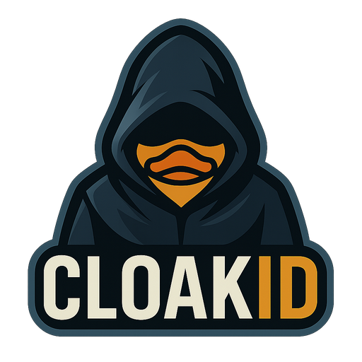

<div align="center">


	
# CloakId

</div>

A .NET library that provides automatic encoding/decoding of numeric properties to obfuscated strings during JSON serialization using attributes. This helps prevent exposing internal numeric IDs in APIs while maintaining clean, readable code.

## Features

- **Attribute-based**: Simply mark properties with `[Cloak]` to enable encoding
- **Automatic JSON conversion**: Properties are automatically encoded to strings during serialization and decoded back during deserialization
- **Pluggable encoding**: Support for different encoding strategies (Sqids provided out of the box)
- **Dependency injection**: Full integration with Microsoft.Extensions.DependencyInjection
- **Type safety**: Compile-time type checking with support for all numeric types
- **Nullable support**: Full support for nullable numeric types

## Why This Library is Useful

While CloakId is **not a substitute for proper security measures** like Role-Based Access Control (RBAC), authentication, and authorization, it provides valuable protection against information disclosure and business intelligence gathering.

### Business Intelligence Protection

**The German Tank Problem**: During WWII, Allied forces estimated German tank production by analyzing captured tank serial numbers. By observing the highest serial number and using statistical analysis, they could accurately determine total production numbers and manufacturing rates. This same principle applies to modern web applications.

### Real-World Scenarios

**Competitor Analysis**: 
- A competitor signs up for your service and receives user ID `12345`
- One month later, they create another account and receive user ID `15678`  
- **Without obfuscation**: They now know you gained ~3,333 users that month
- **With CloakId**: They see IDs like `A6das1` and `xnF9Hu` - no business intelligence can be extracted

**Resource Enumeration**:
- Attackers often probe sequential IDs to map your system: `/api/users/1`, `/api/users/2`, etc.
- **Without obfuscation**: Reveals total user count, active vs. deleted accounts, growth patterns
- **With CloakId**: Each ID appears random, preventing systematic enumeration

### Security Through Defense in Depth

CloakId adds an important layer to your security strategy:

1. **Primary Security**: RBAC, authentication, authorization (always required)
2. **Secondary Security**: CloakId obfuscation (makes attacks harder)
3. **Monitoring**: Track suspicious patterns in your metrics

### What CloakId Prevents

- **Business intelligence gathering** by competitors
- **Growth rate analysis** through sequential ID observation  
- **Database size estimation** via highest observed IDs
- **Resource enumeration attacks** using predictable patterns

### What CloakId Does NOT Provide

- **Authentication or authorization** - you still need proper access controls
- **Cryptographic security** - this is obfuscation, not encryption
- **Protection against authorized users** - valid users can still access their permitted data

**Remember**: CloakId is about making unauthorized reconnaissance significantly more difficult, not replacing fundamental security practices.

## How It Works

CloakId provides a **completely unintrusive** solution by working **transparently at the serialization boundary**:

**The Magic Happens at the Boundary:**
- **JSON Serialization**: Automatic conversion from numbers → encoded strings
- **JSON Deserialization**: Automatic conversion from encoded strings → numbers
- **Model Binding**: Route parameters automatically decoded (`/users/A6das1` → `id: 12345`)

This boundary-based approach provides **clean separation** between your client and server code:

**On the Server Side:**
- Your business logic works with **native numeric types** (`int`, `long`, etc.)
- No wrapper types, no special handling required
- Code remains clean and type-safe

**On the Client Side:**
- APIs receive and send **encoded strings** (`"A6das1"`, `"xnF9Hu"`)
- No knowledge of internal numeric values
- Consistent string-based interface

## Quick Start

### 1. Install packages

```xml
<PackageReference Include="CloakId" Version="1.0.0" />
<PackageReference Include="CloakId.Sqids" Version="1.0.0" />
```

### 2. Configure services

```csharp
using CloakId;
using CloakId.Sqids;
using Microsoft.Extensions.DependencyInjection;

var services = new ServiceCollection();
services.AddCloakIdWithSqids(minLength: 6); // Configure Sqids encoding
services.AddCloakId(); // Add the type info resolver

var serviceProvider = services.BuildServiceProvider();
```

### 3. Use the attribute in your DTOs

```csharp
public class UserDto
{
    [Cloak]
    public int UserId { get; set; }

    [Cloak]
    public long AccountId { get; set; }    // Regular properties without the attribute remain unchanged
    public int RegularId { get; set; }
    
    public string Name { get; set; }
    
    [Cloak]
    public int? OptionalId { get; set; }
}
```

### 4. Configure JSON serialization

```csharp
var typeInfoResolver = serviceProvider.GetRequiredService<CloakIdTypeInfoResolver>();

var jsonOptions = new JsonSerializerOptions
{
    TypeInfoResolver = typeInfoResolver
};
```

### 5. Serialize/Deserialize

```csharp
var user = new UserDto
{
    UserId = 12345,
    AccountId = 98765432109876,
    RegularId = 999, // This remains as a number
    Name = "John Doe",
    OptionalId = 42
};

// Serialize - only [Cloak] properties become encoded strings
var json = JsonSerializer.Serialize(user, jsonOptions);
// Result: {"UserId":"A6das1","AccountId":"xnF9HulfM","RegularId":999,"Name":"John Doe","OptionalId":"JgaEBg"}

// Deserialize - strings decode back to original values
var deserializedUser = JsonSerializer.Deserialize<UserDto>(json, jsonOptions);
// deserializedUser.UserId == 12345
// deserializedUser.AccountId == 98765432109876
// deserializedUser.RegularId == 999 (unchanged)
```

## Supported Types

The `[Cloak]` attribute can be applied to the following numeric property types:

- `int` and `int?`
- `uint` and `uint?`
- `long` and `long?`
- `ulong` and `ulong?`
- `short` and `short?`
- `ushort` and `ushort?`

## Direct Codec Usage

You can also use the codec directly for manual encoding/decoding:

```csharp
var codec = serviceProvider.GetRequiredService<ICloakIdCodec>();

var originalValue = 12345;
var encoded = codec.Encode(originalValue, typeof(int)); // "A6das1"
var decoded = (int)codec.Decode(encoded, typeof(int)); // 12345
```

## ASP.NET Core Model Binding

CloakId includes built-in support for ASP.NET Core model binding, allowing automatic conversion of encoded route parameters:

```csharp
// Enable model binding in Program.cs
builder.Services.AddCloakIdWithSqids();
builder.Services.AddControllers().AddCloakIdModelBinding();

// Use in controllers
[HttpGet("{id}")]
public IActionResult GetUser([Cloak] int id) // Automatically converts "A6das1" → 12345
{
    return Ok(new { UserId = id });
}
```

Routes like `GET /api/users/A6das1` will automatically convert the encoded string to the numeric ID before reaching your controller method. See [Model Binding Documentation](docs/ModelBinding.md) for complete details.

## Security Configuration

CloakId provides configurable security options for model binding:

```csharp
// Configure fallback behavior for enhanced security
builder.Services.AddControllers().AddCloakIdModelBinding(options =>
{
    // Disable numeric fallback for better security (default: false)
    // When false: only accepts encoded strings, rejects numeric IDs
    // When true: accepts both encoded strings and numeric IDs (backwards compatibility)
    options.AllowNumericFallback = false;
});
```

**Security Note**: Setting `AllowNumericFallback = false` provides better security by rejecting any non-encoded values, but may break existing clients that send numeric IDs. The fallback behavior could potentially expose alphabet patterns through systematic testing.

## Metrics and Monitoring

CloakId includes built-in metrics using `System.Diagnostics.Metrics` for monitoring security-related behavior:

### Available Metrics

- `cloakid_model_binding_decoding_success_total` - Successful decodings
- `cloakid_model_binding_decoding_failure_total` - Failed decodings  
- `cloakid_model_binding_numeric_fallback_total` - **Security-relevant**: Fallback usage
- `cloakid_model_binding_fallback_rejection_total` - Rejected requests when fallback disabled
- `cloakid_model_binding_decoding_duration_ms` - Decoding performance

The **numeric fallback metric** is particularly important for security monitoring as it can indicate potential attempts to probe the encoding alphabet through systematic testing.

## Configuration Options

### Sqids Configuration

```csharp
services.AddCloakIdWithSqids(
    alphabet: "abcdefghijklmnopqrstuvwxyz0123456789", // Custom alphabet
    minLength: 8 // Minimum length of encoded strings
);
```

### Attribute Configuration (Future Enhancement)

```csharp
public class UserDto
{
    [CloakId(MinLength = 8)]
    public int UserId { get; set; }
    
    [CloakId(Alphabet = "ABCDEFGHIJKLMNOPQRSTUVWXYZ")]
    public long AccountId { get; set; }
}
```

## Custom Codecs

You can implement your own encoding strategy by implementing `ICloakIdCodec`:

```csharp
public class MyCustomCodec : ICloakIdCodec
{
    public string Encode(object value, Type valueType) { /* ... */ }
    public object Decode(string encodedValue, Type targetType) { /* ... */ }
}

// Register your codec
services.AddSingleton<ICloakIdCodec, MyCustomCodec>();
```

## Example Output

When serialized to JSON, your attributed properties will look like this:

```json
{
  "UserId": "A6das1",
  "AccountId": "xnF9HulfM",
  "RegularId": 999,
  "Name": "John Doe",
  "OptionalId": "JgaEBg"
}
```

Instead of exposing the raw numeric values:

```json
{
  "UserId": 12345,
  "AccountId": 98765432109876,
  "RegularId": 999,
  "Name": "John Doe", 
  "OptionalId": 42
}
```

Notice how only the properties marked with `[Cloak]` are encoded, while `RegularId` remains as a number.

## Performance

CloakId is designed for performance with minimal overhead. You can run comprehensive benchmarks to see the performance characteristics:

### Running Benchmarks

```bash
# Run all benchmarks
./run-benchmarks.ps1

# Run only encoding/decoding benchmarks
./run-benchmarks.ps1 "*Encode*"

# Run only JSON serialization benchmarks  
./run-benchmarks.ps1 "*Json*"

# Run only happy path tests
./run-benchmarks.ps1 "*HappyPath*"

# Run only error handling tests
./run-benchmarks.ps1 "*SadPath*"

# Quick validation run
./run-benchmarks.ps1 "*" --dry
```

### Sample Results

Based on benchmarks, typical performance characteristics:

- **Encoding**: ~4 microseconds per int32 value
- **JSON Serialization**: ~40 microseconds for small models
- **Memory allocation**: ~21KB allocated per serialization of typical models
- **Error handling**: Fast exception handling for invalid data

See `/benchmarks/README.md` for detailed benchmark information.

## Benefits

1. **Security**: Internal numeric IDs are not exposed in API responses
2. **Clean Code**: Simple attribute-based approach, no wrapper types needed
3. **Selective**: Choose exactly which properties to encode
4. **Type Safety**: Full support for nullable types and type checking
5. **Performance**: Efficient encoding/decoding with minimal overhead
6. **Flexibility**: Easy to swap encoding strategies without changing business logic

## License

This project is licensed under the MIT License - see the LICENSE file for details.
